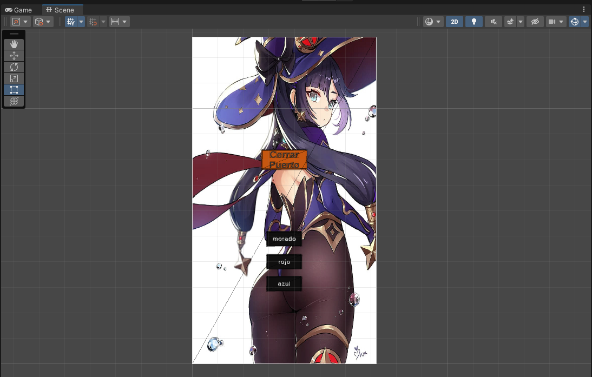
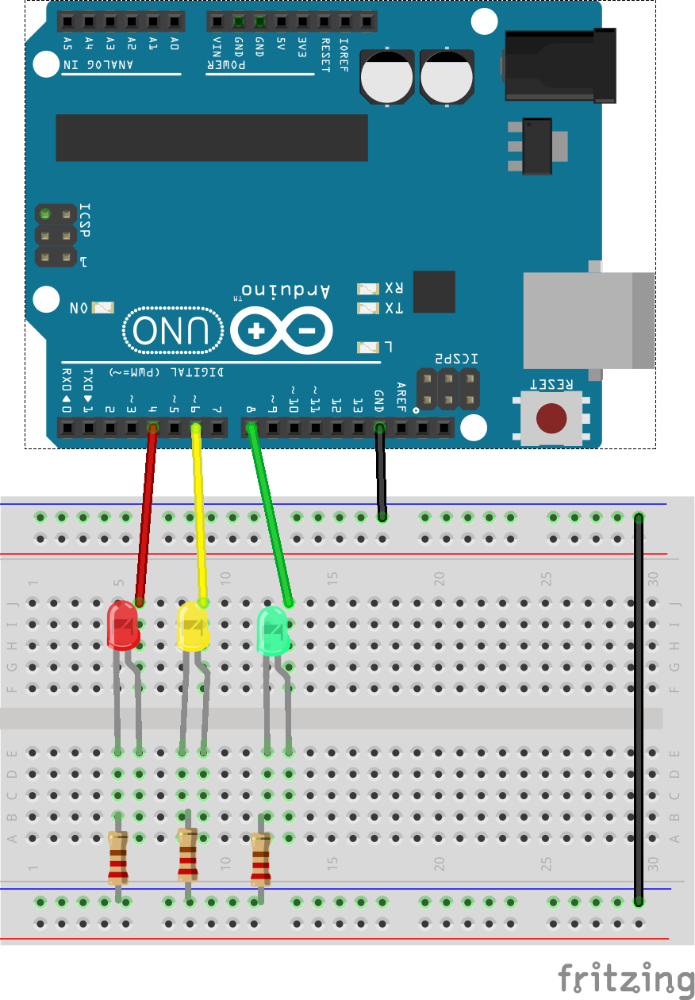

# Comunicación serial Unity + Arduino Uno

> basado en el tutorial de [jadsa tv](https://www.youtube.com/watch?v=ApZb-PbZ3pc)

## Tecnologías usadas
* dotnet 6.0.300
* Unity 2021.3.31 LTS
* Arduino

:octocat: :+1:

